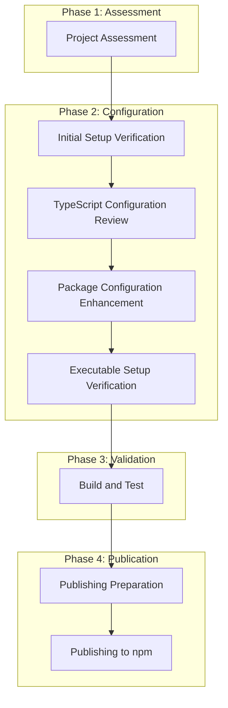

# TypeScript Package Distribution Plan

This document outlines the plan for setting up the MCP Cloudscape Assistant package for distribution to npm.

## Process Overview

## Detailed Steps

### Phase 1: Assessment

#### 1. Project Assessment

**Current Status:**
- ✅ package.json exists with name, version, description
- ✅ TypeScript is installed as a dev dependency
- ✅ tsconfig.json exists with proper configuration
- ✅ Source directory and entry points exist
- ✅ .gitignore is set up

**Action Items:**
- Verify all required fields in package.json
- Check if any dependencies should be moved to peerDependencies
- Ensure all necessary files are included in the distribution

### Phase 2: Configuration

#### 2. Initial Setup Verification

**Current Status:**
- ✅ package.json has name, version, description
- ✅ Git repository is initialized
- ✅ TypeScript and development tools are installed
- ✅ Source directory and entry points exist
- ✅ .gitignore is set up

**Action Items:**
- Verify repository field in package.json
- Check if any additional development tools are needed

#### 3. TypeScript Configuration Review

**Current Status:**
- ✅ tsconfig.json exists
- ✅ declaration: true is set
- ✅ outDir is configured to ./dist
- ✅ rootDir is set to .
- ✅ include and exclude are properly configured

**Action Items:**
- Review module and target settings
- Ensure sourceMap is enabled for debugging
- Verify that all necessary files are included

#### 4. Package Configuration Enhancement

**Current Status:**
- ✅ main field is set to dist/server-fastmcp.js
- ✅ types field is set to dist/server.d.ts
- ✅ bin field is configured
- ✅ build and prepare scripts exist
- ❓ files field may need verification

**Action Items:**
- Verify files field includes all necessary distribution files
- Ensure clean, build, prepare, and prepublishOnly scripts are properly configured
- Review dependencies vs. devDependencies vs. peerDependencies

#### 5. Executable Setup Verification

**Current Status:**
- ✅ Main entry point is server.ts (NOT cli.ts)
- ✅ bin field in package.json is configured to use dist/server.js
- ✅ postbuild script makes the executable file executable

**Action Items:**
- Verify the executable functionality
- Ensure proper error handling in the main entry point
- Confirm that app.ts is used as the entry point, NOT cli.ts

### Phase 3: Validation

#### 6. Build and Test

**Action Items:**
- Build the package with npm run build
- Verify the build output (JavaScript and declaration files)
- Link the package locally for testing
- Test executable functionality
- Create a test project to test the package as a dependency

### Phase 4: Publication

#### 7. Publishing Preparation

**Action Items:**
- Verify package readiness with pre-publishing checks
- Create or log in to npm account
- Review documentation (README.md)
- Verify license
- Update version before publishing

#### 8. Publishing to npm

**Action Items:**
- Perform final checks before publishing
- Publish the package to npm
- Add npm version badge to README (optional)
- Set up CI/CD for automated publishing (optional)

## Mode Assignments

- **Architect Mode**: Overall planning and coordination
- **Code Mode**: Implementation of configuration changes and build process
- **Debug Mode**: Testing and validation
- **Documentation Mode**: README and documentation updates
- **Release Engineer Mode**: Publishing preparation and npm publication

## Timeline

1. **Phase 1 (Assessment)**: 1 day
2. **Phase 2 (Configuration)**: 2-3 days
3. **Phase 3 (Validation)**: 1-2 days
4. **Phase 4 (Publication)**: 1 day

Total estimated time: 5-7 days

## Important Notes

- The main entry point for this package is server.ts, which will be compiled to dist/server.js
- We are NOT using cli.ts as the entry point
- The package.json bin field should point to dist/server-fastmcp.js
- All references to the entry point should be consistent throughout the configuration