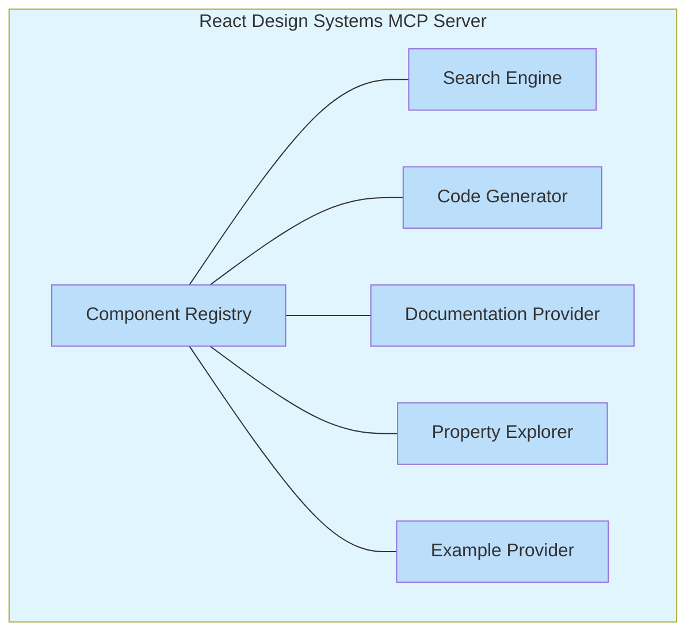
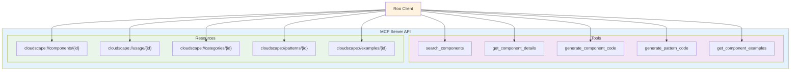
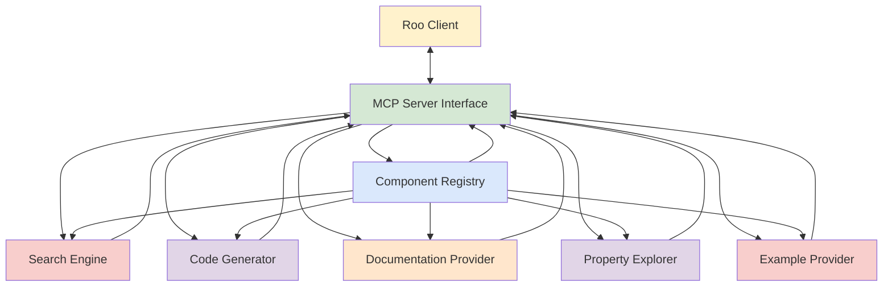

# React Design Systems MCP Server Architecture

This document outlines the detailed architecture of React Design Systems MCP server, which provides comprehensive information about design systems created for React. The current version focuses exclusively on the AWS Cloudscape Design System components, along with code generation capabilities.

## System Architecture

React Design Systems follows a modular architecture with the following key components:



### Component Registry

The Component Registry is the core of React Design Systems. It stores metadata and documentation for all supported design system components, currently focusing on Cloudscape components.

**Key Responsibilities:**
- Maintain a comprehensive registry of all 84+ Cloudscape components
- Store component metadata (name, category, description, etc.)
- Track component relationships and dependencies
- Provide version information for components

**Data Structure:**
```typescript
interface ComponentMetadata {
  id: string;                 // Unique identifier for the component
  name: string;               // Display name of the component
  category: string;           // Component category (e.g., Navigation, Container, Input)
  description: string;        // Brief description of the component
  importPath: string;         // Import path for the component
  version: string;            // Component version
  isExperimental: boolean;    // Whether the component is experimental
  relatedComponents: string[]; // Related component IDs
  tags: string[];             // Tags for searching
}
```

### Search Engine

The Search Engine provides efficient component search and retrieval functionality.

**Key Responsibilities:**
- Search components by name, category, or functionality
- Filter components based on various criteria
- Rank search results by relevance
- Support fuzzy matching for search terms

**Search Capabilities:**
- Exact match: Find components that exactly match the search term
- Fuzzy match: Find components that approximately match the search term
- Category search: Find components in a specific category
- Functionality search: Find components that provide specific functionality
- Tag-based search: Find components with specific tags

### Code Generator

The Code Generator generates code snippets for common Cloudscape patterns.

**Key Responsibilities:**
- Generate code snippets for individual components
- Generate code for component combinations and patterns
- Provide customization options for generated code
- Support different code styles and formats

**Code Generation Capabilities:**
- Basic component usage
- Component with props
- Component with children
- Component with event handlers
- Component combinations for common patterns
- Responsive layouts
- Form patterns
- Navigation patterns
- Data visualization patterns

### Documentation Provider

The Documentation Provider serves detailed component documentation.

**Key Responsibilities:**
- Provide comprehensive documentation for components
- Serve usage guidelines and best practices
- Offer accessibility information
- Provide design guidelines

**Documentation Types:**
- Component overview
- Props documentation
- Usage examples
- Accessibility guidelines
- Design guidelines
- Best practices
- Common pitfalls
- Migration guides

### Property Explorer

The Property Explorer allows exploration of component properties and their usage.

**Key Responsibilities:**
- List all properties for a component
- Provide property descriptions and types
- Show default values for properties
- Offer usage examples for properties

**Property Information:**
- Name
- Type
- Description
- Default value
- Required/optional status
- Accepted values
- Deprecation status
- Examples

### Example Provider

The Example Provider offers usage examples for components.

**Key Responsibilities:**
- Provide basic usage examples
- Offer advanced usage examples
- Show component combinations
- Demonstrate responsive behavior

**Example Types:**
- Basic usage
- With different props
- With children
- With event handlers
- In different contexts
- With different themes
- Responsive examples
- Accessibility examples

## Integration with Roo

The React Design Systems MCP server integrates with Roo through the Model Context Protocol (MCP). It provides the following tools and resources:



### Tools

1. **search_components**: Search for Cloudscape components
   ```typescript
   interface SearchComponentsInput {
     query: string;
     category?: string;
     tags?: string[];
     limit?: number;
   }
   ```

2. **get_component_details**: Get detailed information about a component
   ```typescript
   interface GetComponentDetailsInput {
     componentId: string;
   }
   ```

3. **generate_component_code**: Generate code for a component
   ```typescript
   interface GenerateComponentCodeInput {
     componentId: string;
     props?: Record<string, any>;
     children?: string;
     eventHandlers?: Record<string, string>;
   }
   ```

4. **generate_pattern_code**: Generate code for a common pattern
   ```typescript
   interface GeneratePatternCodeInput {
     patternId: string;
     customizations?: Record<string, any>;
   }
   ```

5. **get_component_examples**: Get usage examples for a component
   ```typescript
   interface GetComponentExamplesInput {
     componentId: string;
     type?: string;
     limit?: number;
   }
   ```

### Resources

1. **cloudscape://components/{componentId}**: Get component details
2. **cloudscape://categories/{categoryId}**: Get category details
3. **cloudscape://patterns/{patternId}**: Get pattern details
4. **cloudscape://examples/{exampleId}**: Get example details
5. **cloudscape://properties/{componentId}/{propertyId}**: Get property details

## Data Flow

The following diagram illustrates the data flow within the React Design Systems MCP server:



1. Roo client sends a request to the MCP Server Interface
2. The MCP Server Interface routes the request to the appropriate component
3. The component processes the request and returns the result
4. The MCP Server Interface formats the result and sends it back to the Roo client

## Security Considerations

- **Authentication**: The MCP server uses secure authentication mechanisms
- **Authorization**: Access to the MCP server is restricted to authorized users
- **Data Validation**: All input data is validated before processing
- **Error Handling**: Errors are handled gracefully and do not expose sensitive information
- **Logging**: All operations are logged for audit purposes
- **Rate Limiting**: Requests are rate-limited to prevent abuse

## Performance Considerations

- **Caching**: Frequently accessed data is cached for improved performance
- **Indexing**: Component data is indexed for efficient search
- **Pagination**: Large result sets are paginated to reduce response size
- **Compression**: Responses are compressed to reduce bandwidth usage
- **Asynchronous Processing**: Long-running operations are processed asynchronously